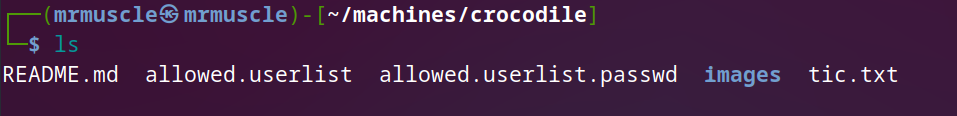

# Basic of penetration testing

***In our journy to learn penetration testing we take a machines in HTB to can explain the basics of penetration***

## crocodile machine

- after connecting with vpn you will spawn the machine and you will have the ip address for this machine .

- as we explained in earlier machines you must know how to download vpn and connect with HTB server and ping for IP_address .
  
### Enumeration

- we will begin with `nmap` tool to check what is the open ports in the target machine .

- we will use this command `sudo nmap -sC -sV -A {IP_address}` , in the next image you can study what this command do.

- Here is the output of the nmap search .
  

- in the previous image you will notice that .
  
- we find an open port which is `21/tcp` and the running service is `ftp` and the version is `vsftpd 3.0.3`.

- and in the "ftp-anon" you will see that the anonymous ftp login allowed and the `ftp code is 230`.
- and also we have to files we will download ( allowed.userlist, allowed.userlist.passwd ).

- don't panic I will explain to you all things that you should understand .

- **let's start with what is ftp?**
  
  - `ftp` is stands for "file transfer protocol"
  - this is is the simplest protocl to transfer data between to hosts .
  - with the `ftp`  service you can make some simple transfering data like (download , upload , discover) .
  - we can use ftp with `cli` .
  - this is the basics you should know , skip this part now and I will show you how to use `ftp cli`  .

- in the previous image you will notice that .  
- we find an open port which is `80/tcp` and the service is `http` and the version is `apache httpd 2.4.41` .
- if you reach to this point this you should know that when we find and `port80` open this is mean that we gonna deal with online website.

#### foothold

***I know that the problem with beginners is that they do not know how to think, or more precisely, they do not know where to start, so I will teach you how to think after you have obtained some important information from enumeration***

- you should ask yourself what should I do here ?
  
  - we have some information like ther is the running servic called `ftp` and running service called http in `port80` .
  - then we will know how to connect with `ftp` and try to download the two files we found in nmap search .
  - after this step we will know if we got any good information to do any thin with the website.
  

- Here the ftp connection steps .
  
  
  
  - we will begin with simply type `ftp` in our terminal .
  
  
  - fell free to type `help` to know what is the command you can use .
  
  
  - in the previous image we typed `ftp "IP_Address_for_taraget machine"` .
  - after you type this command you will asked about your name .
  - and here we will the information we collected from our scan .
  - try to guess this information .
  - if you say that we will use the `anonymous` login then you are right , because in the nmap scan we find that anonyomus login is allowed.
  
  - after type `anonymous` you will successfully login.
  - Then type `dir` or `ls` to list all direcotry or filles in the server.
  - As you can see in the previous image we have to filles , let's learn how to download them.

- type `get allowed.userlist` to download the allowed.userlist file.
- And type `get allowed.userlist` to download the allowed.userlist.passwd file.
- after you got the "file transfer complete " go to your local directory and you will find the files you just downloaded.
  

- let's know what is inside this files

- we will use those usernames and password , I think you can guess **where ?**
- If you said that we will use them in the website then you are smart enough to be a future hacker.
  
- we took all we can take from the ftp service , let's deal with `port80` .
  
***go to your web browser and type `IP_address:80`***

- you will got the full website like following .
  

- after use every button in the website and finding that there is nothing we can do .
- don't lose the trust of me and let's learn what we can do in things like this.
- we will use the common tool in this situation which called `gobuster` .
- `gobuster` tool is the most used tool in diging in the websites .
- and this tool will give you the hidden urls and subdomains and will give you and directory that related with this website .
- when I said the related directory i mean that the directory that will take you to other branch of the website , let's see.
  
- after downloading `gobuster` .
- we will use the next command to intialize the tool .
- `gobuster dir -x php -u IP_address -w /usr/share/worllists/dirb/common.txt` .
- if you don't have the `common.txt` file , you can download it from github and store it in the path I just performed.

- AS you can see in the previous image we have some related directory and the directory I think will be more important called `login.php` .
  
- just type in your browser's search bar the next command `IP_address/login.ph`.

- Here you got this window and you need the user_name and password to be in the database .
- what we will do now ?
- we will try the user_names and passwords we downloaded from the ftp server.
- after trying you will find that the next one make you admin in the website .
  

- then you will be in .
  

- We successfully got the flag! It is displayed for us at the top of the admin panel.
- Congratulations , Assem_Ayman
